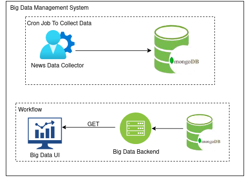
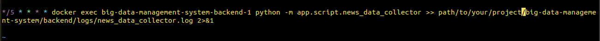
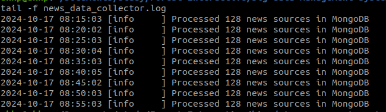
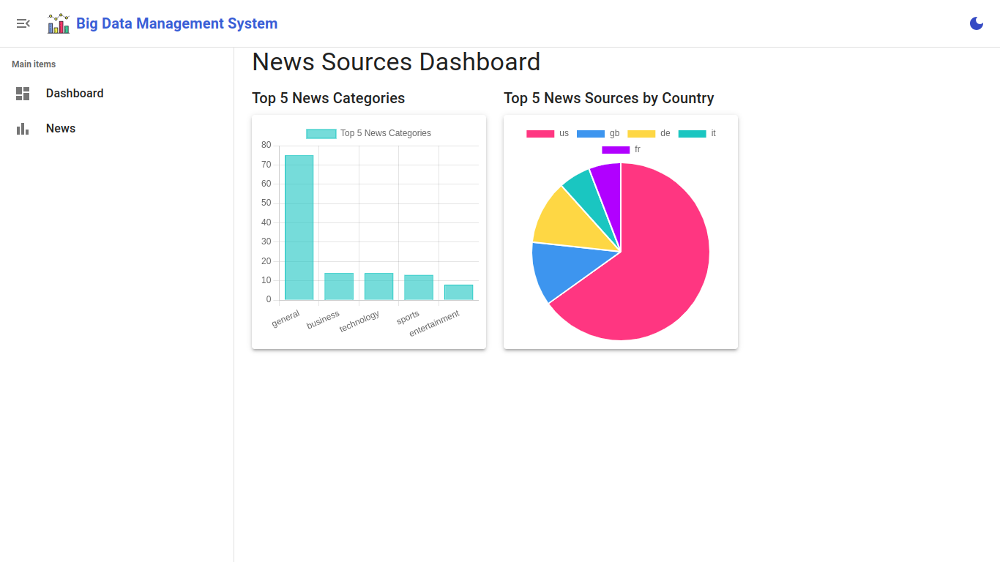
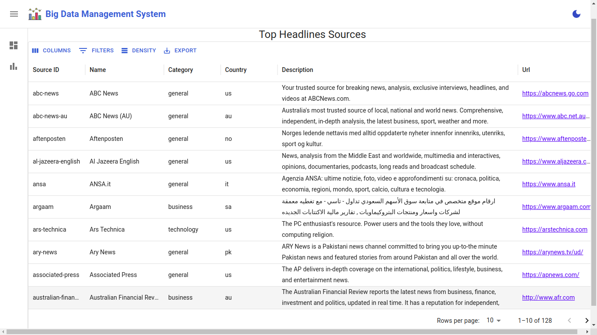
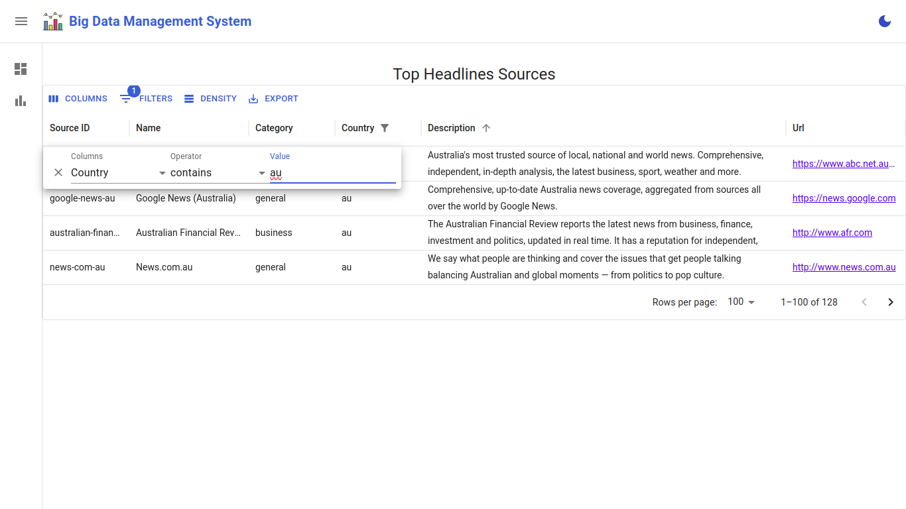
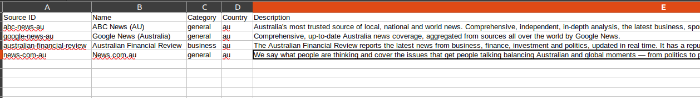

# Big Data Management System and Reporting Dashboard

## Overview:

The system has three key components: a Python script that collects data from NewsAPI and stores it in MongoDB, running on a cron job. The data visualization and reporting layer is a front-end dashboard that displays and reports the stored data, offering search, filter, and CSV export features.



## Tech Stack
### Backend:
- **Language**: Python (FastAPI) - For building the API to manage and serve data.
- **Database**: MongoDB (NoSQL) - To store the collected news publisher data.
- **Scheduler**: Cron Job - To periodically run the data collection script from NewsAPI.

### Frontend:
- **ReactJS + Vite** - For building the user interface.
- **Chart.js/react-chartjs-2** - For data visualization through charts and graphs.
- **Material-UI** - A modern UI framework for responsive and clean design.

### Deployment:
- **Docker** - Containerization for both backend and database services.
- **NPM** - For managing front-end dependencies.

### Prerequisites
1. **Docker** - Install Docker to manage containers.
2. **Docker Compose** - Required to manage multiple services (MongoDB, backend, and frontend).
3. **Node.js & NPM** - Required for the front-end setup and development.
4. **Python (v3.8+)** - Required for running the FastAPI backend.
5. **MongoDB** - A MongoDB instance (either locally or cloud-based).
6. **NewsAPI Key** - Get an API key from [NewsAPI](https://newsapi.org/) for fetching news data.

## Setup Instructions

### 1. Clone the Repository
```bash
$ git clone https://github.com/your-username/big-data-management-system.git
$ cd big-data-management-system
```
### 2. Frontend Setup with NPM
```
$ cd frontend/big-data-ui
$ npm install
$ npm run dev # For Start development server
$ npm run build # Build for production
```

### 2. Backend and MongoDB Setup with Docker Compose
```
$ cd backend
$ cp .env.example .env # Update the environment variables in .env as needed
```
- Run `docker-compose up --build` to start the backend and MongoDB. Alternatively, you can start the backend manually by running `uvicorn app.main:app --host 0.0.0.0 --port 8000`.

  **Note:** The FastAPI backend will run at http://localhost:8000, and MongoDB will be accessible at port 27017.

  **Running Steps:**
  - For the News collector cron job, run the following command.:
   
  - Data Collection Log
   


  **Backend API Documentation**
  - The API documentation for the project is available at [API Docs](https://github.com/AyeKhantKhantPo/big-data-management-system/blob/main/docs/big-data-api-docs.html).

## Demo
- The Frontend UI is accessible at http://localhost:5173/
  
- **Dashboard Page:**
  
  
- **List View Page:**
  
  
- **Filter Support in List View:**
  
  
  
- **Download Filtered Data as CSV:**
  
